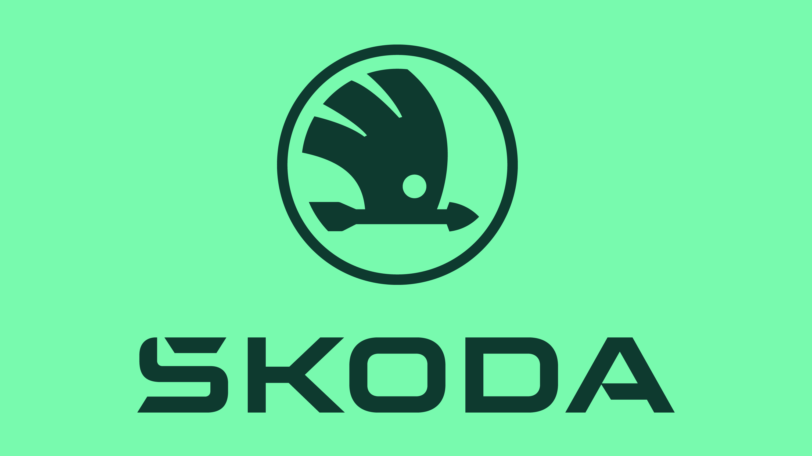
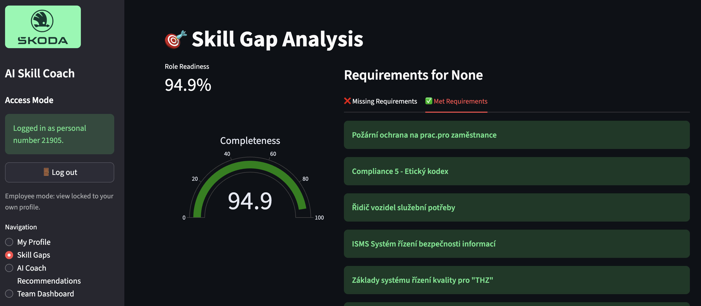

<div align="center">
  
  
</div>

<br>

<div align="center">

[](https://www.skoda-auto.cz/ "Platforms")
[](https://www.skoda-auto.cz/ "Languages")
[](https://www.skoda-auto.cz/ "Ai")

</div>

---

# 🤖 AI Skill Coach

AI Skill Coach is an intelligent talent development assistant built with Python and Streamlit, powered by Azure AI for advanced data analysis. Running locally on localhost, it helps organizations turn raw HR and performance data into actionable insights for growth.

* Runs as a Streamlit web app on localhost.
* Uses Azure AI to analyze skill and performance datasets.
* Automatically detects skill gaps at both individual and team levels.
* Suggests personalized courses and learning paths for self-improvement.
* Helps managers see strengths and weaknesses across their teams.
* Supports employees in discovering career growth and promotion opportunities.


Transform your workforce data into a smart AI coach that guides continuous learning and career development.

---

## 🖼️ Preview

<div align="center">
  
</div>

---

## 🛠️ Usage and Installation

1. **Add Required Datasets to the `data` Directory**
```
Required files:
  Degreed_Content_Catalog.xlsx
  Degreed.xlsx
  ERP_SK1.Start_month - SE.xlsx
  RLS.sa_org_hierarchy - SE.xlsx
  Skill_mapping.xlsx
  ZHRPD_VZD_STA_007.xlsx
  ZHRPD_VZD_STA_016_RE_RHRHAZ00.xlsx
  ZPE_KOM_KVAL.xlsx
```

2. **Configure Environment Variables in `.env`**
```
AZURE_OPENAI_API_KEY=`your_api_key_here`
AZURE_OPENAI_ENDPOINT=`your_endpoint_url`
AZURE_OPENAI_DEPLOYMENT_NAME=hackathon-gpt-4.1
AZURE_OPENAI_API_VERSION=2025-01-01-preview
```

3. **Set Up the Virtual Environment**
```bash
python3 -m venv venv
```

4. **Activate the Virtual Environment**
```bash
source venv/bin/activate
```

5. **Install Project Dependencies**
```bash
pip install -r requirements.txt
```

6. **Run the Application**
```bash
streamlit run app.py
```

---

## ⭐ Support

Hope you like it!