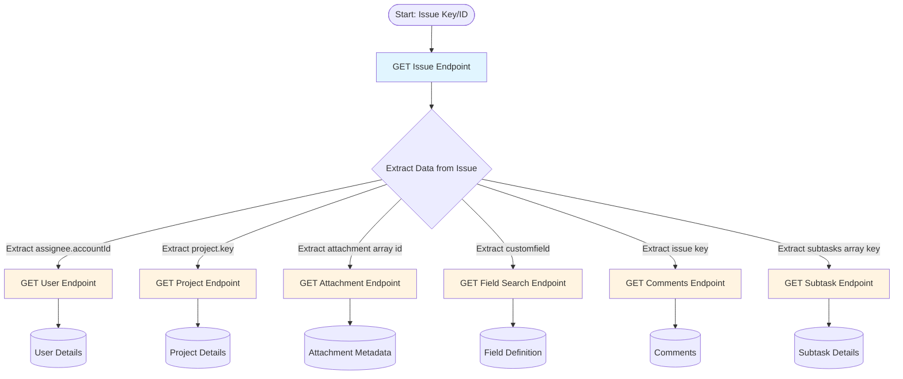
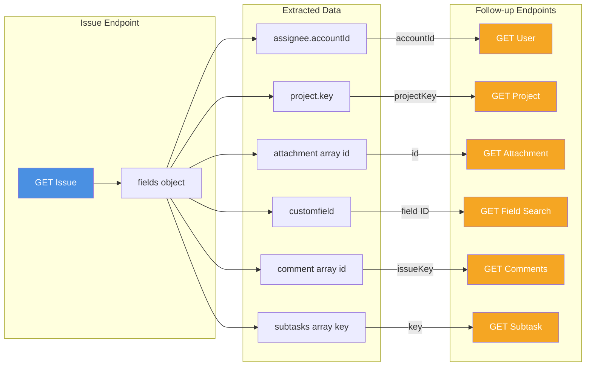
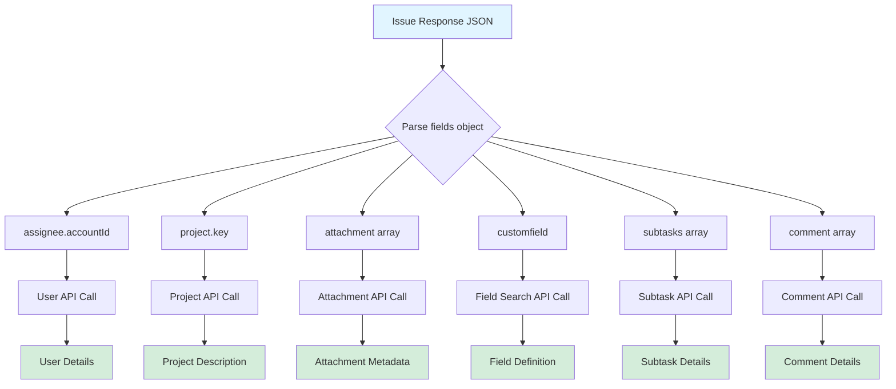
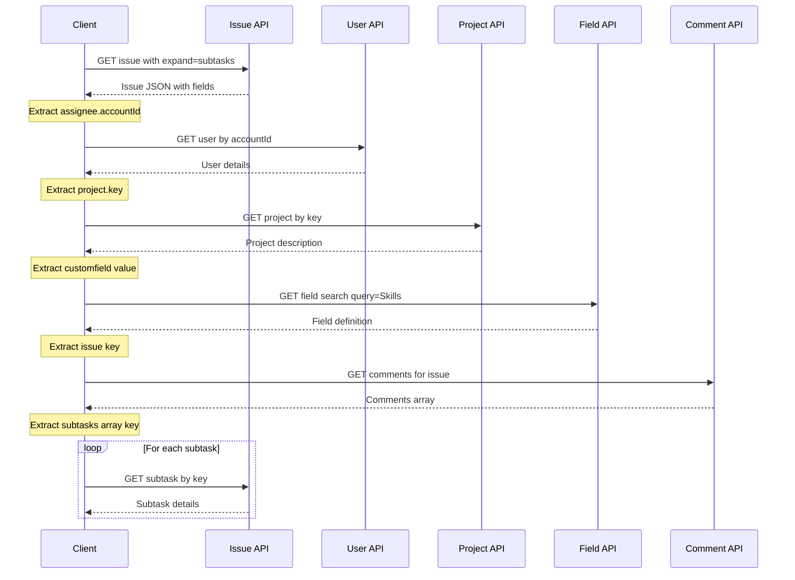

# Jira API v3 - Endpoint Flow Graph

This document shows the relationships and follow-up flows between Jira REST API v3 endpoints.

## Main Flow Diagram



## Detailed Relationship Graph



## Data Extraction Flow



## Complete Workflow Example



## Field Mapping Reference

### From Issue Response → Follow-up Calls

| Issue Field Path | Extracted Value | Follow-up Endpoint | Purpose |
|-----------------|----------------|-------------------|---------|
| `fields.assignee.accountId` | `"5b10a2844c20165700ede21g"` | `GET /rest/api/3/user?accountId=xxx` | Get assignee details |
| `fields.project.key` | `"EX"` | `GET /rest/api/3/project/EX` | Get project description |
| `fields.attachment[].id` | `10000` | `GET /rest/api/3/attachment/10000` | Get attachment metadata |
| `fields.customfield_10000` | Field value | `GET /rest/api/3/field/search?query=Skills` | Get field definition |
| `fields.sub-tasks[].outwardIssue.key` | `"ED-2"` | `GET /rest/api/3/issue/ED-2` | Get subtask details |
| `key` | `"DEMO-1"` | `GET /rest/api/3/issue/DEMO-1/comment` | Get all comments |

## Common Use Cases

### Use Case 1: Get Complete Issue Information
```
1. GET /rest/api/3/issue/{key}?expand=subtasks,names,renderedFields
   ↓ Extract: assignee.accountId, project.key, customfield_XXXXX
2. GET /rest/api/3/user?accountId={accountId}
3. GET /rest/api/3/project/{projectKey}
4. GET /rest/api/3/field/search?query=Skills
```

### Use Case 2: Get Issue with All Attachments
```
1. GET /rest/api/3/issue/{key}
   ↓ Extract: attachment[].id
2. For each attachment:
   GET /rest/api/3/attachment/{id}
   GET /rest/api/3/attachment/content/{id} (download)
```

### Use Case 3: Get Issue with All Subtasks
```
1. GET /rest/api/3/issue/{key}?expand=subtasks
   ↓ Extract: sub-tasks[].outwardIssue.key
2. For each subtask:
   GET /rest/api/3/issue/{subtaskKey}
```

### Use Case 4: Get Issue with Comments
```
1. GET /rest/api/3/issue/{key}
   ↓ Extract: key
2. GET /rest/api/3/issue/{key}/comment?startAt=0&maxResults=50
```

## Notes

- **Expand Parameter**: Use `expand=subtasks,names,renderedFields` to get subtasks and readable field names in a single call
- **Pagination**: Comments and field search support pagination with `startAt` and `maxResults`
- **Custom Fields**: Custom field IDs follow pattern `customfield_XXXXX` where XXXXX is the field ID
- **Account IDs**: Always use `accountId` (not username) for user lookups in v3 API
- **ADF Format**: Description and comment bodies use Atlassian Document Format (structured JSON)

